# 50. データベースとは何か

大量のデータを整理された形で保存し，必要に応じて高速かつ安全に検索・更新・管理できる仕組み。  
RDBMS（リレーショナルデータベース管理システム）は，データを表（テーブル）として管理し，行と列の関係によってデータ同士の関連を表現する。  
SQLと呼ばれる専用言語を用いて，データの追加・取得・更新・削除を行える点が特徴であり，Webサービスや業務システムなど幅広い分野で利用されている。

# 51. SQLiteを用いたデータベースの作成
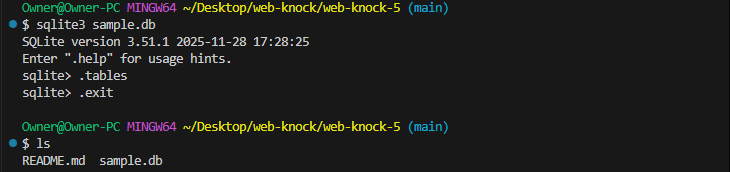

# 52. SQLでテーブルを作成
sqlite3 sample.db < create_users.sql (ファイルから実行)  
.tables                 (テーブル一覧)  
.schema テーブル名  

  
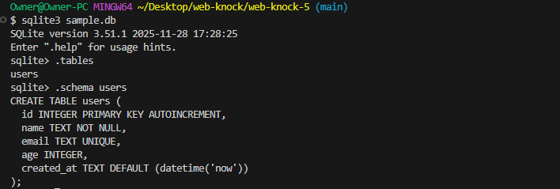

# 53. レコードの追加・検索

# 54. レコードの更新・削除
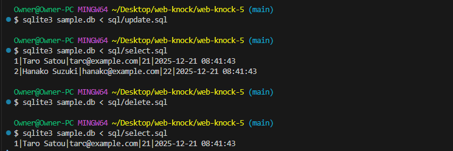

# 55. 複数条件での検索や並べ替え
where: 条件に合致するレコードを抽出する。
order by: 並べ替える。
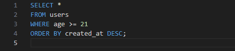
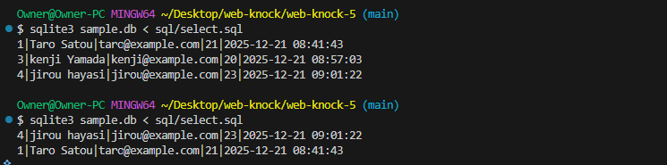

# 56. Node.jsからデータベースに接続
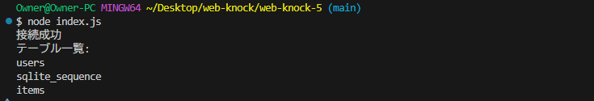
[kadai56.js](kadai56.js)
# 57. Webサーバとデータベースの連携
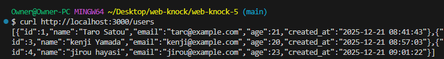

# 58. Webフォームからの入力データをデータベースに登録
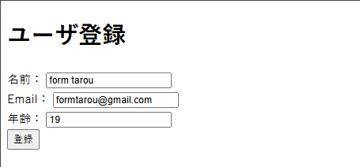
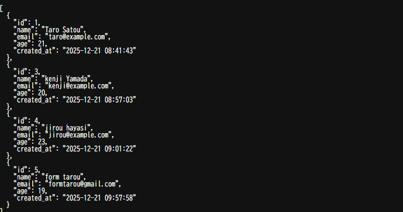

# 59. 登録データの編集・削除機能の実装
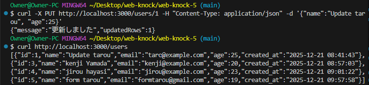
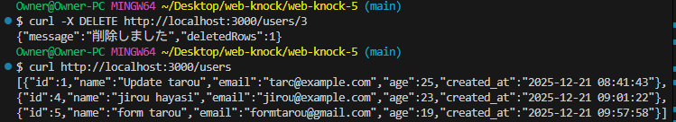
[kadai59.js](kadai59.js)